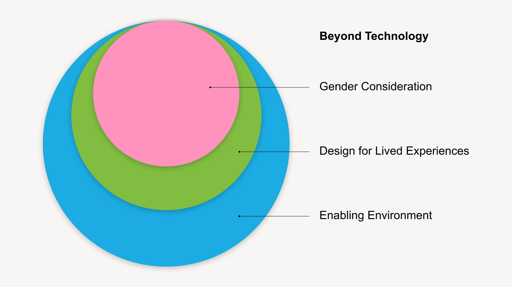

# Beyond Technology

When collaborating with governments on Digital Transformation, the process extends beyond mere technology implementation.

> “The technical system itself is pretty straightforward. It’s everything surrounding it \[that makes it complex].” —Research Participant

<figure><figcaption></figcaption></figure>

## An Enabling Environment

Technology serves an enabler, yet its effectiveness hinges on the presence of an enabling environment. Such an environment thrives on effective communication and stakeholder buy-in, complemented by comprehensive training and effective change management.

## Designing for the Lived Experience&#x20;

Stakeholders must grasp the intricacies of citizens and the workforce, along with the environments in which they operate. When designing service delivery models, training and change management, stakeholders need to understand health workers, community leaders and others that could be working in the field as registrars. Below is a sample of realities to understand:&#x20;

* If you’re going to use health workers, how are you going to use them knowing that they are super busy?&#x20;
* Have you been to the hospital? Do you know if there’s a charger? Is there wifi?&#x20;
* If you need to use data, who’s paying for it?&#x20;
* Which devices will be used? If using personal phones, how will you manage access?

## Gender Consideration

Every Digital Transformation project should consider the experience of female users. In several parts of the world, women have unique digital realities and often face greater limitations. To start considering gender, ask these questions:

* What have you found out about female users?&#x20;
* What did you do differently because of this?

For more resources on how to design for the digital reality of women and girls, check out the **Gender Tech Toolkit:** [https://www.unicef.org/eap/innovation-and-technology-gender-equality](https://www.unicef.org/eap/innovation-and-technology-gender-equality).

\
