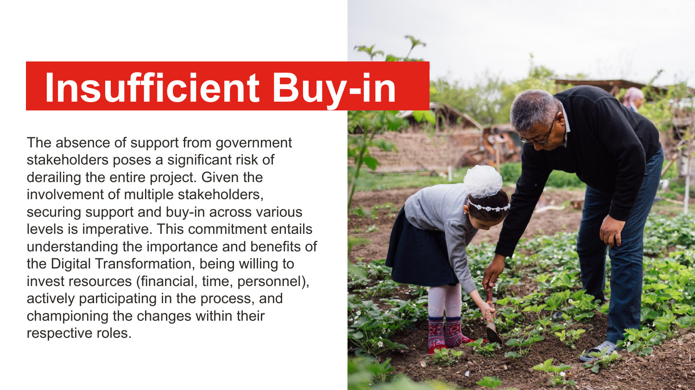
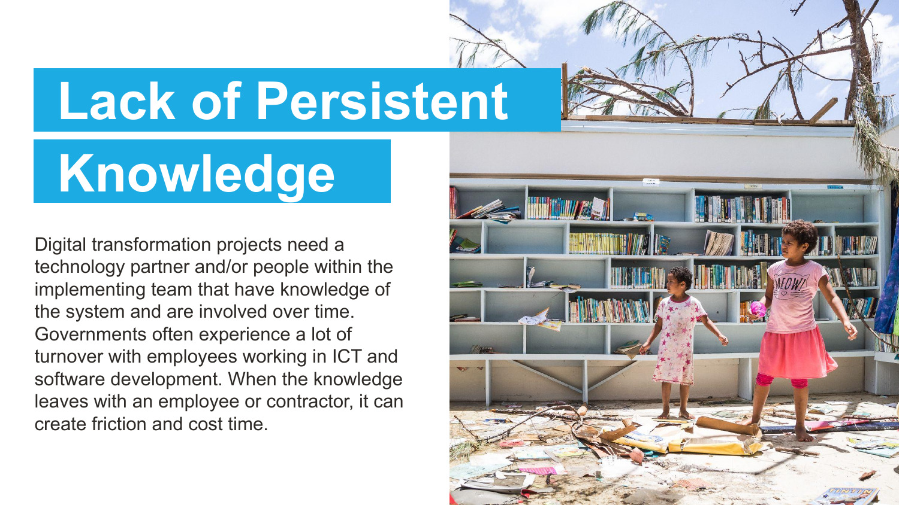
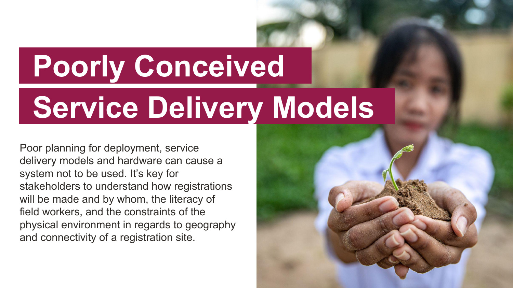
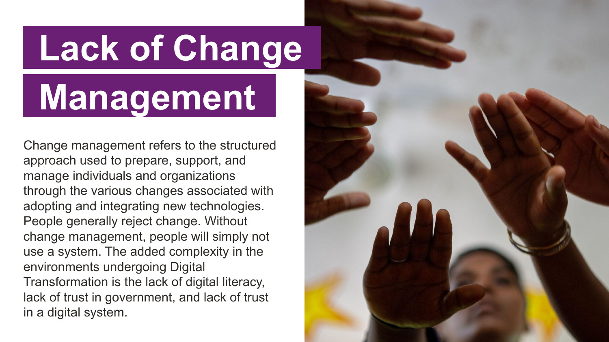
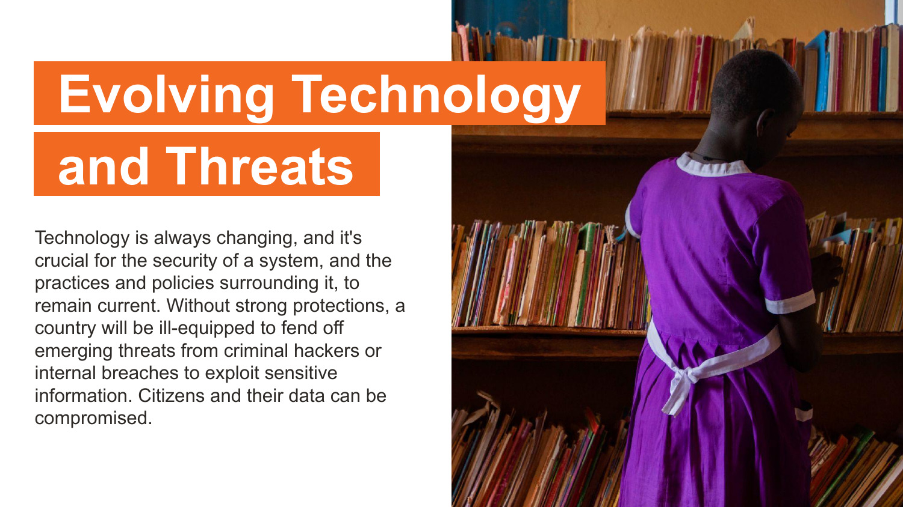

# Threats to Success

<i>Most relevant for 💭 [Visionaries](../get-started.md#visionaries) and 🔥 [Advisors](../get-started.md#advisors)&#x20;</i>

The success of a system or program is not only dependent on the technology itself, but all of the people and processes surrounding it. Based on stakeholder research, we've identified 9 threats to success that will directly impact the integration and adoption of a technology solution.&#x20;

> ### <mark class="blue">In order to foster holistic security, we must broaden our scope beyond system vulnerabilities and cybersecurity threats to technology. We must also acknowledge and address the threats introduced by the people and processes involved.</mark>

<figure><figcaption>
<a href="threats-to-success.md">Threats to Success executive summary presentation</a>
</figcaption></figure>

<mark style="color:purple;">View the full visual presentation highlighting threats to success through the following slides:</mark>

[Threat to Success PDF Download](../.gitbook/assets/Exec Sum_ Threats to Success [April 2024].pdf)

## The Nine Threats to Success of Digital Transformation&#x20;

### <mark style="color:orange;">1. Insufficient Buy-In</mark>

The absence of support from government stakeholders poses a significant risk of derailing the entire project. Given the involvement of multiple stakeholders, securing support and buy-in across various levels is imperative. This commitment entails understanding the importance and benefits of the Digital Transformation, being willing to invest resources (financial, time, personnel), actively participating in the process, and championing the changes within their respective roles.

<figure><figcaption></figcaption></figure>

### <mark style="color:orange;">2. Vendor Lock-In</mark>

Locking into a vendor offering proprietary software can limit access to the system. In some cases, this has led to the loss of generations because the data could no longer be accessed. In other cases, it can lead to very high costs to maintain and improve the software.

<figure><figcaption></figcaption></figure>

### <mark style="color:orange;">3. Missing Expertise</mark>

Business analysts and individuals with experience managing government IT projects play critical roles in conceptualizing and planning for a system that is a critical foundation for Digital Transformation. Without their involvement and leadership, decisions could be made that make it difficult or expensive to extend and improve the system.&#x20;

<figure><figcaption></figcaption></figure>

### <mark style="color:orange;">4. Lack of Persistent Knowledge</mark>

Digital transformation projects need a technology partner and/or people within the implementing team that have knowledge of the system and are involved over time. Governments often experience a lot of turnover with employees working in ICT and software development. When the knowledge leaves with an employee or contractor, it can create friction and cost time.

<figure><figcaption></figcaption></figure>

### <mark style="color:orange;">5. Premature Scaling</mark>

Premature scaling occurs when a software company that’s implementing a system scales it without going through a pilot stage where they prove that the system is ready to scale. During a pilot, a system is tested in a range of settings and improved. This process is complemented with a scalable, integrated rollout plan.

<figure><figcaption></figcaption></figure>

### <mark style="color:orange;">6. Poorly Conceived Service Delivery Models</mark>

Poor planning for deployment, service delivery models and hardware can cause a system not to be used. It’s key for stakeholders to understand how registrations will be made and by whom, the literacy of field workers, and the constraints of the physical environment in regards to geography and connectivity of a registration site.

<figure><figcaption></figcaption></figure>

### <mark style="color:orange;">7. Lack of Change Management</mark>

Change management refers to the structured approach used to prepare, support, and manage individuals and organizations through the various changes associated with adopting and integrating new technologies. People generally reject change. Without change management, people will simply not use a system. The added complexity in the environments undergoing Digital Transformation is the lack of digital literacy, lack of trust in government, and lack of trust in a digital system.&#x20;

<figure><figcaption></figcaption></figure>

### <mark style="color:orange;">8. Limited Long-term Assistance and Financial Resources</mark>

Insufficient consideration of ongoing costs and support frameworks can result in scenarios where essential needs remain unfulfilled despite their existence. This encompasses both the financial requirements for sustaining a system and the support mechanisms necessary to ensure its continuous updates and security. It's imperative that the government has access to skilled personnel and the financial means to retain them, ensuring that the system remains accessible and functional in meeting its intended purposes.

<figure><figcaption></figcaption></figure>

### <mark style="color:orange;">9. Evolving Technology and Threats</mark>

Technology is always changing, and it's crucial for the security of a system, and the practices and policies surrounding it, to remain current. Without strong protections, a country will be ill-equipped to fend off emerging threats from criminal hackers or internal breaches to exploit sensitive information. Citizens and their data can be compromised.

<figure><figcaption></figcaption></figure>

