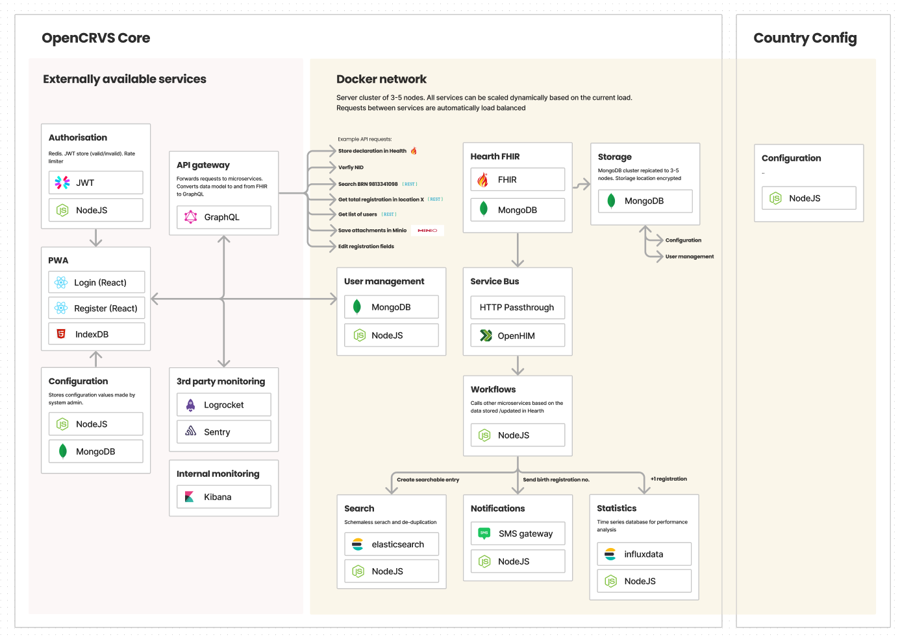
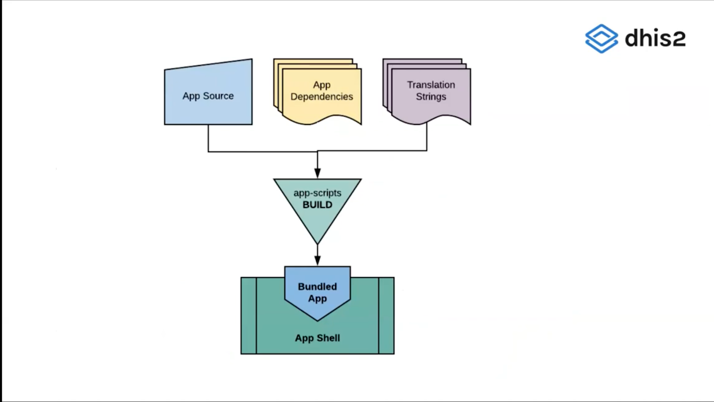

# Application Architecture

The Application Architecture review provides a holistic view of the structure of the application, on how the different components, database, APIs, and third-party libraries interact within the code under the lens of maintainability, performance at scale, re-usability, customization, and flexibility.

## Our approach provides a comprehensive analysis of the platform's configuration, extensibility, and maintainability.&#x20;

The process also takes into account longevity and adaptability over nearly the life of the project, inlcluding the evolution technologies it is built upon, and the types of architecture approaches utilized. The process considers any complexity introduced by chosen approaches, and how it may impact scalability or breadth of codebase. Also considered is the release schedule and the continuous improvements made, and how that reflects upon the technological foundation.

In the review process, extensive documentation and source code are analyzed, and development environments are deployed using using tools provided by the solution.&#x20;

<figure><figcaption>
<a href="https://documentation.opencrvs.org/technology/architecture">Example Application Architecture from OpenCRVS</a> 
</figcaption></figure>

### The architecture audit also focuses on how the solution can be configured and extended, especially considering its the specific user stories and needs that need to be satisfied.&#x20;

Technical sophistication required for configuration and extension is also considered, and how that process is supported by detailed documentation and tutorials. It is key to understand if only developers can extend a platform or solution, or if it is open to non-developers, as well. Testing any core functionality extensions through creating custom applications, can also help understand the solution's flexibility.&#x20;

<figure><figcaption>
A diagram on building and bundling custom applications for <a href="https://dhis2.org/">DHIS2</a>
</figcaption></figure>

Lastly, the review assesses the solution's potential for scalability and performance at larger scales. This includes whether the solution is more inclined for verticial or horizontal scaling.

\
