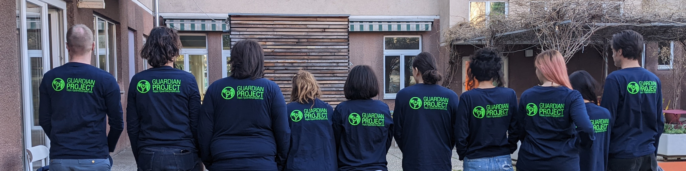

# The Team

With 15 years of experience in the Human Rights and Internet Freedom space, [Guardian Project](https://guardianproject.info) is dedicated to building apps and technologies prioritising the safety and protection of those we work with. \

<figure><figcaption></figcaption></figure>

We are a group of designers, developers, innovators and technicians. Working at the intersection of human and digital rights alongside communities to find solutions which are secure, protect privacy and fit within community contexts. Our core values include security, privacy, and transparency, reflected in all our developments.&#x20;

<figure><figcaption>
We are actual humans who care!
</figcaption></figure>

The core team of contributors for this work include:

* Nathan Freitas, Project Director and Technical Advisor &#x20;
* Tiffany Robertson, Project Manager
* Darren Clarke, Source Code & Application Architecture Auditor
* Abe Luck, Source Code & Application Architecture Auditor
* Iain Learmonth, DevSecOps Auditor&#x20;
* Carrie Winfrey, Researcher & Designer

Independent Auditors:

* Mikael Von Pfaler, Auditor
* Michael Pons, Auditor
* Paul Mayero, Auditor

#### Relevant Expertise

[Our work](https://guardianproject.info) at has always been focused on the human rights and humanitarian context, aiming to bend technology to better serve people and communities whose data and digital communications are at higher risk of being exploited and used against them. Over the last 15 years, we have provided security and privacy-focused software architecture, development, and operational deployment services across the human rights and humanitarian technology space.  We have experience managing complex multi-year, multi-million dollar technical projects with many stakeholders, and hundreds of thousands to millions of end-users.

#### Open-Source Engagement

For over a decade, we have also been heavily involved in open-source software communities, in particular those focused on privacy-enhancing technology, security-by-design and the minimization of tracking by third-parties. We have worked within projects that are part of Debian, Tor Project, Mozilla, Android, and more. We also lead and nurture our own open-source projects and communities, such as [Clean Insights](https://cleaninsights.org), [F-Droid](https://f-droid.org), and [ProofMode](https://proofmode.org).&#x20;

#### Secure Development Operations

Our DevOps team has worked to define a best-of-breed approach to supporting development and deployment of secure and privacy services protecting high-risk data. We have experience deploying on Amazon Web Services, which is ISO certified for Cloud Security and Data Protection, Microsoft Azure Cloud, Fastly, and other independent hosting providers. For network security purposes, we use private virtual intranets and web application firewalls to secure access to our services. When possible, all content stored is encrypted using cryptographic keys generated using end-to-end encryption protocols, and that are only resident in the user’s device or browser.&#x20;

#### Privacy-Preserving Measurement and Analytics

We also take a privacy-preserving approach to measurement - in most cases, no full IP addresses are logged by our servers or analytics services, only country level information. Access logs are stored for the minimal amount of time necessary to operate the service, and are not shared with any third-party. All internal and external communications within our team are encrypted (TLS, VPN, SSH, OpenPGP, Signal, Matrix). All of our services require two-factor authentication access with hardware token, from authorised devices.

#### Security Culture

Implementation of regular security audits and updates ensure that security standards are upheld. In addition to our own internal auditing and manual and automated testing, we use reputable third-party penetration “Red Team” testing teams to test the security of our services on an annual basis or after major releases.

\
