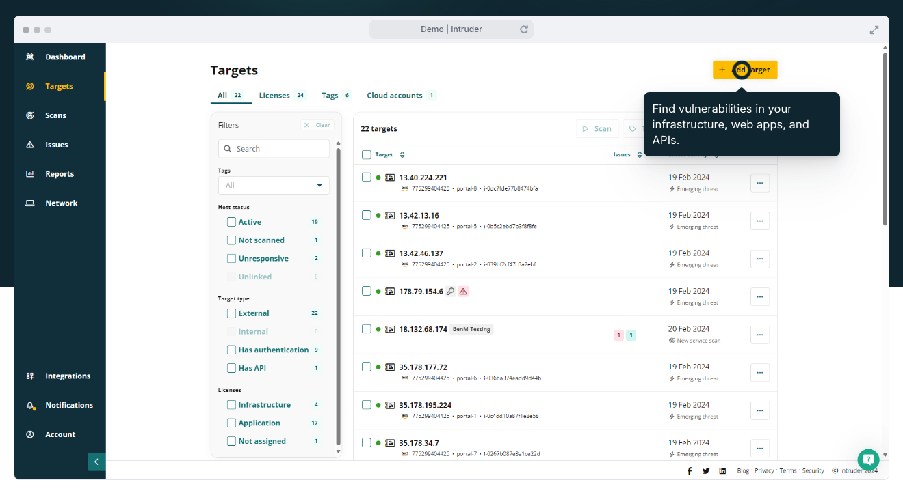

# Resources, Links & Tools

## Tool List Overview

The reviewer should use a variety of tools to perform the assessment, including automated scanners, integrated cloud testing tools and services (Astra, Intruder), such as Burp Suite and OWASP ZAP, as well as manual testing tools like Postman, cURL, or browser extensions. Additionally it may be useful to use platforms which are designed to improve the CI/CD process.&#x20;

### CI/CD Tools

Tools we recommend for improving the efficiency and effectiveness of continuous integration and deployment:

* [**GitLab**](https://www.google.com/search?rlz=1C5CHFA\_enES1058ES1058\&sca\_esv=2a9720fd994fa302\&sca\_upv=1\&cs=0\&q=gitlab\&stick=H4sIAAAAAAAAAF1Ru0rDUBhu5Vjb9KLEyS0IzsnJpaZjbQULooIFcQo9JyfX5mKSNjWrbnXyERycdRJfQXwCR8Elj1AQTDs0wfH7fv7\_u\_xVuF\_mF-XWuU9cJvQmASZMb7DYqCrHZ8PB8Fp5AeUUbFNNVmchNBLs8AlCKWhQFOuwnN6ZcXqQgiZVX0LIS4qoceuxFceO768h344NFeYwmOq2k19HMW6LccfIGf2Qg6qWaDljGbLtyElU3FKTCE2FnNH4cOxgRSrcaSNLhhosJBGUxJfFWQpadOPIjNAE2yTKoqegRm9lRGCGJAV1qrZ0qiJRilaTbqB7TK-fApre6V5dMj1PJRemT8amSwoObuFMgn6mV6dr\_cBzCYMZM6-Jk3xkiesiZA5nTebr2GkjHrr2SvFkFLgkDJ82K7oZjUfoq7JXmv88CJ8fN6ffz\_O71sGbIP2-37\_uliaP1X-P\_AMiqWE43wEAAA\&sa=X\&ved=2ahUKEwj0y--UxsCHAxWkLkQIHWWpAToQ7fAIegUIABDhAg\&biw=1379\&bih=683\&dpr=2)**or Github**
  * GitLab Inc. is an open-core company that operates GitLab, a DevOps software package that can develop, secure, and operate software. [Wikipedia](https://en.wikipedia.org/wiki/GitLab)
* [**Azure DevOps Server**](https://azure.microsoft.com/en-us/products/devops/server)
  * Azure DevOps Server, formerly known as Team Foundation Server and Visual Studio Team System, is a Microsoft product that provides version control, reporting, requirements management, project management, automated builds, testing and release management capabilities. [Wikipedia](https://en.wikipedia.org/wiki/Azure\_DevOps\_Server)
* [**Jenkins**](https://www.jenkins.io/)
  * Jenkins is an open source automation server. It helps automate the parts of software development related to building, testing, and deploying, facilitating continuous integration, and continuous delivery. It is a server-based system that runs in servlet containers such as Apache Tomcat. [Wikipedia](https://en.wikipedia.org/wiki/Jenkins\_\(software\))
* [**AWS CodePipeline**](https://aws.amazon.com/codepipeline/)
  * AWS CodePipeline is a continuous delivery service you can use to model, visualize, and automate the steps required to release your software. You can quickly model and configure the different stages of a software release process. CodePipeline automates the steps required to release your software changes continuously.
* [**Spinnaker**](https://spinnaker.io/docs/concepts/)
  * Spinnaker is a free and open-source continuous delivery software platform originally developed by Netflix and extended by Google. It is designed to work with Kubernetes, Google Cloud Platform, AWS, Microsoft Azure and Oracle Cloud. Spinnaker was developed by Netflix as a successor to the internally developed Asgard. [Wikipedia](https://en.wikipedia.org/wiki/Spinnaker\_\(software\))

### Generating Software Bill of Materials (SBOM) Tools

We used the open-source tool [**syft**](https://github.com/anchore/syft) to create a Software Bill of Materials for entire code repositories and also for each Docker image produced from that repository. The advantage of the former is that we get an overview of all packages used in any core code or microservices. With the latter we can look at only the packages that appear in the final Docker image for a given microservice.&#x20;

* [**Syft**](https://anchore.com/opensource/)
  * A CLI tool for generating a Software Bill of Materials (SBOM) from container images and filesystems.

> _"Syft is a powerful and easy-to-use open-source tool for generating Software Bill of Materials (SBOMs) for container images and filesystems. It provides detailed visibility into the packages and dependencies in your software, helping you manage vulnerabilities, license compliance, and software supply chain security."_


**The Syft Github service also offers** [software supply chain features for checking dependencies](https://github.com/features/security/software-supply-chain).


> _"Keep your dependencies up-to-date and optimized and get updates on new vulnerabilities affecting your specific dependencies with Dependabot."_

• **Product page:**[ https://github.com/features/security/software-supply-chain](https://github.com/features/security/software-supply-chain)

• **SBOM export docs:** [https://docs.github.com/en/code-security/supply-chain-security/understanding-your-software-supply-chain/exporting-a-software-bill-of-materials-for-your-repository](https://docs.github.com/en/code-security/supply-chain-security/understanding-your-software-supply-chain/exporting-a-software-bill-of-materials-for-your-repository)

• **Enabling Dependabot docs:** [https://docs.github.com/en/code-security/dependabot/dependabot-security-updates/configuring-dependabot-security-updates](https://docs.github.com/en/code-security/dependabot/dependabot-security-updates/configuring-dependabot-security-updates)\

### **Open-Source Software (OSS) Vulnerability Scanning**

We used the open-source tool [**grype**](https://github.com/anchore/grype) to check the source and Docker images for vulnerabilities.&#x20;

* [**Grype**](https://anchore.com/opensource/)
  * An easy-to-integrate open source vulnerability scanning tool for container images and filesystems.

> _"A vulnerability scanner for container images and filesystems. Easily install the binary to try it out. Works with Syft, the powerful SBOM (software bill of materials) tool for container images and filesystems."_


Docker also offers their own [Docker Scout solution](https://www.docker.com/products/docker-scout/).


> _"Docker Scout generates signals across the software supply chain that inform improved development workflows. Developers are guided by contextual recommendations right where they work, leveraging data collected from a wide range of integrations."_

• **Product page:** [https://www.docker.com/products/docker-scout/](https://www.docker.com/products/docker-scout/)

• **Docs:** [https://docs.docker.com/scout/](https://docs.docker.com/scout/)

### **Static Application Security Testing (SAST) Scanning**

We used the open source SAST scanner [**semgrep**](https://semgrep.dev/) to perform an automated analysis of codebases.

* [**Semgrep**](https://semgrep.dev/)
  * Semgrep guides developers towards secure by default practices. Manage SAST, secrets, and supply chain security in a single platform that eliminates developer friction.

### Dynamic Application Security Testing (DAST) Services

We utilized cloud-based testing suites and services, alongside human teams, that offer a variety of capabilities and options for one-time and ongoing scanning and testing. While fully bespoke and custom security audits are always a valuable service, they come at a very high cost in both money and time. Our approach for this evaluation was to use tools and techniques that are both within the realm of the available budget, and provided a more dynamic, ongoing approach for uncovering vulnerabilities. We recommend this approach for use not only in the evaluation stage, but also as part of the ongoing monitoring of production deployments.

## Cloud-Based Vulnerability Scanning

#### [Intruder.io](https://intruder.io)

Intruder.io: fast, cheap automated vulnerability scanning service, with multiple vantage points; Less feature rich, but still a good tool for initial “smoke test” results

* Emergent Threats performs automated, nearly daily additional ongoing, focused scans based on newly identify threats and vulnerabilities added to the Astra database
* Nessus Agents extend scanning to run within server-infrastructure from the “inside out” uncovering vulnerabilities and configuration issues that an attacker may take advantage of if they compromise a network

<figure><figcaption></figcaption></figure>

#### [**Astra**](https://getastra.com)

Powerful tool+service providing Automated, Vetted, and Emergent Threats vulnerability scanning

* Automated is machine-only scripted testing of a comprehensive set of known vulnerabilities
* Vetted builds on the Automated result, then adds human review and verification of identified potential vulnerabilities to add more detail, and identity and label “false positives”\

<figure><figcaption></figcaption></figure>

